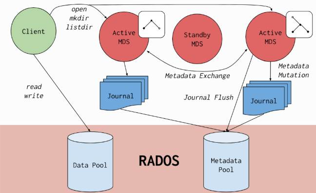

# CephFS Setup and Subvolume Mount Guide

## general architecture


##

### because of ceph file system use two pool one for data and one for meta data you should create these two pool:

```bash
>> ceph osd pool create cephfs_data
```

```bash
>> ceph osd pool create cephfs_metadata
```

### Creating a file system

### Each file system has its own set of MDS daemons assigned to ranks so ensure that you have sufficient standby daemons available to accommodate the new file system.

### Each Ceph File System (CephFS) has a number of ranks, one by default, which starts at zero.

Ranks define how the metadata workload is shared between multiple Metadata Server (MDS) daemons. The number of ranks is the maximum number of MDS daemons that can be active at one time. Each MDS daemon handles a subset of the CephFS metadata that is assigned to that rank.

Each MDS daemon initially starts without a rank. The Ceph Monitor assigns a rank to the daemon. The MDS daemon can only hold one rank at a time. Daemons only lose ranks when they are stopped.

The max_mds setting controls how many ranks will be created.

The actual number of ranks in the CephFS is only increased if a spare daemon is available to accept the new rank.

Rank States

Ranks can be:

Up - A rank that is assigned to the MDS daemon.

Failed - A rank that is not associated with any MDS daemon.

Damaged - A rank that is damaged; its metadata is corrupted or missing. Damaged ranks are not assigned to any MDS daemons until the operator fixes the problem, and uses the ceph mds repaired command on the damaged rank.

For example:

Below is an end-to-end cookbook that starts with an empty three-node Ceph cluster and finishes with user ali mounting a 5 GiB sub-volume from a freshly created CephFS.

### Create metadata and data pools

### or you can enable autoscable for these pool

### Deploy two MDS daemons

### for this first you should find list of hosts by

```bash
>> ceph orch host ls
```

> 

### then use name of hosts to deploy mds daemons

‍‍‍‍

### create the file-system pointing at those pools

```bash
>> ceph fs new cephfs cephfs_meta cephfs_data
```

### Create a 5 GiB sub-volume for ali

```bash
>> ceph fs subvolume create cephfs ali --size 5
```

### Query the path:

```bash
>> ceph fs subvolume getpath cephfs ali
```

> : it use for mount client to subvolume

### Generate a cephx key confined to that sub-volume

```bash
>> ceph auth get-or-create client.ali_new mon 'allow r' osd 'allow rw' mds 'allow rw' -o /etc/ceph/ceph.client.ali_new.keyring
```

```bash
>> ceph fs subvolume authorize cephfs ali client.ali_new --access_level rw
```

### Mount user:

```bash
>> sudo apt install ceph-fuse ceph-common
```

Bellow command you provided is used to modify the FUSE (Filesystem in Userspace) configuration file to allow non-root users to access FUSE-mounted filesystems. Here's a breakdown:

```bash
>> sudo bash -c 'echo "user_allow_other" >> /etc/fuse.conf'
```

Mount user to subvolume

1  Get your cephx keyring and put it in your client

```bash
>> ceph auth get client.ali -o ~/client.ali.keyring
```

Install the Ceph client bits (once per workstation)

```bash
>> sudo apt install ceph-fuse ceph-common
```

3  Find the monitor addresses

```bash
>> ceph -s | grep monmap
```

Put /etc/ceph/ceph.conf placed in your ceph cluster on client something like this:

Do this:

You can also use this method

You can unmout it by

```bash
>> fusermount -u ~/cephfs
```

wipe a CephFS subvolume and retire the client that was using it.

### Check who is still using the share

```bash
>> ceph fs subvolume authorized_list <filesystem_name> <subvolume name>
```

### Revoke the client’s future access

```bash
>> ceph fs subvolume deauthorize <file system name> <subvolume name> client.<client id>
```

### Ex:

```bash
>> ceph fs subvolume deauthorize cephfs ali client.ali
```

### Kick the client off right now

```bash
>> ceph fs subvolume evict <file system name> <subvolume name> client.<client id>
```

### Ex:

```bash
>> ceph fs subvolume evict cephfs ali client.ali
```

### Use this when the user forgot to unmount or you cannot reach the host.

### Remove the subvolume itself

```bash
>> ceph fs subvolume rm <file system name> <subvolume name>
```

### Ex:

```bash
>> ceph fs subvolume rm cephfs ali
```

### Delete the cephx user (only if it has no other duties)

```bash
>> ceph auth del client.<client id>
```
