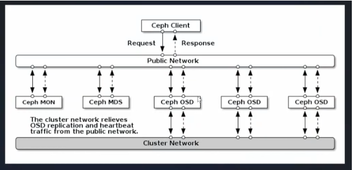

# Ceph Storage Installation and Configuration on Ubuntu 22.04 (Jammy) with Cephadm

This guide provides step-by-step instructions for deploying a **three-node Ceph Reef 18.2.5** cluster on **Ubuntu 22.04 LTS** servers using **cephadm** and **Podman**.

---

## 1. Overview

Ceph is a **distributed storage system** providing **object, block, and file** interfaces.\
Modern Ceph is deployed with **cephadm**, which runs each daemon (**MON**, **MGR**, **OSD**, **MDS**, **RGW**) in containers, orchestrated with **Podman** or **Docker**.

---

## 2. Environment Layout

| Host Role          | Hostname       | IP Address   | Responsibilities            |
| ------------------ | -------------- | ------------ | --------------------------- |
| Master / Bootstrap | master-worker1 | 192.168.1.14 | Initial MON, MGR, dashboard |
| Worker Node 2      | worker2        | 192.168.1.13 | MON, MGR, OSDs              |
| Worker Node 3      | worker3        | 192.168.1.12 | MON, MGR, OSDs              |

---

## 3. Prerequisites

- Three **Ubuntu 22.04.4 LTS** servers with `root` or `sudo` access
- Static IPs on a single network (e.g., `192.168.1.0/24`)
- At least **one dedicated data disk per OSD** on each worker node
- Internet access to download packages and container images

---

## 4. System Preparation on All Nodes

```bash
# 4.1 Update OS and reboot
apt update && apt dist-upgrade -y && reboot

# 4.2 Install required tools and Podman
apt install -y podman lvm2 chrony curl

# 4.3 Disable swap and optimize swappiness
swapoff -a
echo "vm.swappiness = 1" > /etc/sysctl.d/99-ceph.conf
sysctl --system

# 4.4 Configure hostnames and /etc/hosts
hostnamectl set-hostname <master-worker1 | worker2 | worker3>
cat <<EOF >> /etc/hosts
192.168.1.14 master-worker1
192.168.1.13 worker2
192.168.1.12 worker3
EOF

# 4.5 Enable and start time synchronization
systemctl enable --now chrony
```

---

## 5. Installing cephadm

```bash
# Download cephadm
curl -LO https://download.ceph.com/rpm-reef/el9/noarch/cephadm
chmod +x cephadm

# Add the upstream Reef repository
./cephadm add-repo --release reef
apt update

# Install ceph-common
./cephadm install ceph-common
```

---

## 6. Bootstrapping the First Node

```bash
cephadm bootstrap \
  --mon-ip 192.168.1.14 \
  --cluster-network 192.168.1.0/24
```

Dashboard: `https://192.168.1.14:8443`




---

## 7. Adding Worker Nodes to the Cluster

```bash
# 1. Extract bootstrap public key
ceph cephadm get-pub-key > ceph.pub

# 2. Copy key to workers
ssh-copy-id -f -i /etc/ceph/ceph.pub root@worker2
ssh-copy-id -f -i /etc/ceph/ceph.pub root@worker3

# 3. Enter cephadm shell (MON container)
cephadm shell

# 4. Register hosts
ceph orch host add worker2 192.168.1.13
ceph orch host add worker3 192.168.1.12
```

---

## 8. Deploying Monitors and Managers

```bash
ceph orch apply mon --placement="count:3"
ceph orch apply mgr --placement="count:3"
```

---

## 9. Creating OSDs

```bash
# Quick Method
ceph orch apply osd --all-available-devices

# Granular Method
sudo ceph orch daemon add osd worker2:/dev/ceph_vg/osd_data
sudo ceph orch daemon add osd worker3:/dev/ceph_vg/osd_data

# Multiple Devices
ceph orch daemon add osd ceph1:/dev/sdb,sdc,sdd
```

---

## 10. Verifying Cluster Health

```bash
# Status
ceph -s

# Host list
ceph orch host ls

# Running containers
ceph orch ps
```

---

## 11. Optional Services

| Service | Command                                                                        |
| ------- | ------------------------------------------------------------------------------ |
| CephFS  | `ceph orch apply mds cephfs --placement="count:3"`                             |
| S3/RGW  | `ceph orch apply rgw mystore --realm=default --zone=us1 --placement="count:3"` |
| iSCSI   | `ceph orch apply iscsi iscsi-gw --placement='1 host_pattern *'`                |

---

## 12. Ceph in Containers

- Each daemon runs in container image: `quay.io/ceph/ceph:v18.2.5`
- Check with `podman ps` or `docker ps`
- Data, WAL, DB volumes stored in `/var/lib/ceph/<fsid>/<daemon>/`

---

## 13. Rolling Upgrades

```bash
ceph orch upgrade start --image quay.io/ceph/ceph:v18.2.6
```

---

## 14. Key Takeaways and Next Steps

- **Podman** works natively on Ubuntu Jammy; Docker optional
- **Cephadm** is the official containerized installer
- Use bootstrap SSH key in `/etc/ceph/ceph.pub` or import your own
- Monitor via dashboard or Prometheus/Grafana
- Extend storage with pools, RBD, CephFS, RGW

