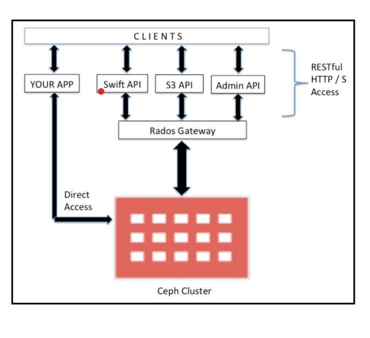

# ceph object storage

## general architecture


## RADOS Gateway (RGW) Frontends

Ceph’s RADOS Gateway (RGW) supports multiple frontends, which determine how clients connect to the gateway. The most common frontend is the `civetweb` HTTP server, but others are available for different use cases.

### Common Frontends

- **civetweb**:  
  The default and recommended frontend. It provides HTTP and HTTPS support and is suitable for most deployments.
  ```
  rgw_frontends = "civetweb port=80"
  ```
  You can specify additional options, such as SSL certificates for HTTPS.

- **beast**:  
  An alternative HTTP(S) frontend based on Boost.Beast, available in newer Ceph versions.

- **fastcgi**:  
  Allows RGW to run behind a FastCGI-capable web server (like Apache or Nginx).  
  ```
  rgw_frontends = "fastcgi socket_port=9000"
  ```

### Configuring Frontends

Set the `rgw_frontends` option in your Ceph configuration file (`ceph.conf`) under the `[client.radosgw.*]` section. Example:
```
[client.radosgw.gateway]
rgw_frontends = "civetweb port=8080"
```

For more details and advanced options, see the [official documentation](https://docs.ceph.com/en/mimic/radosgw/frontends/).


## Deploying RADOS Gateway (RGW) with cephadm

You can deploy and manage Ceph RADOS Gateway (RGW) daemons using the `ceph orch apply rgw` command with cephadm. This command schedules and configures RGW instances on your Ceph cluster.

### Basic RGW Deployment

To deploy an RGW instance with the default settings:

```bash
ceph orch apply rgw aip-rgw
```

- `aip-rgw` is the name of the RGW service instance.
- This command schedules the deployment of the RGW service on available hosts.

### Advanced Placement and Port Options

You can control where and how many RGW daemons are deployed using the `--placement` and `--port` options:

```bash
ceph orch apply rgw aip-rgw '--placement=label:rgw count-per-host:2' --port=8000
```

- `--placement=label:rgw count-per-host:2`  
  Deploys RGW daemons on hosts labeled `rgw`, with 2 instances per host.
- `--port=8000`  
  Sets the RGW service to listen on port 8000.

**Example Output:**
```
Scheduled rgw.aip-rgw update...
```

> **Note:**  
> - Make sure your hosts are labeled appropriately (e.g., `ceph orch host label add <host> rgw`).
> - You can check the status of the RGW service with `ceph orch ls` or `ceph -s`.

For more details, see the [Ceph Orchestrator documentation](https://docs.ceph.com/en/latest/cephadm/services/rgw/).

### Checking Which Nodes Run RGW Daemons

To see which nodes are running RGW (RADOS Gateway) daemons in your Ceph cluster, use the following command:

```bash
ceph orch ps --daemon-type=rgw
```

This command lists all RGW daemons and shows the nodes (hosts) where each RGW instance is running.

Alternatively, you can use:

```bash
ceph orch ls --service-type=rgw
```

This shows a summary of RGW services and their placement across the cluster.

### When you deploy an RGW (RADOS Gateway) instance using the command:

```bash
ceph orch apply rgw aip-rgw
```

Ceph automatically creates several pools required for object storage and RGW operation. You can view all pools in your cluster with:

```bash
ceph osd pool ls
```

Typical pools you may see include:

- **.rgw.root**  
  Stores the root objects and bucket index information for RGW.

- **default.rgw.log**  
  Stores RGW log data, such as usage and access logs.

- **default.rgw.control**  
  Used internally by RGW for control operations and coordination.

- **default.rgw.meta**  
  Stores metadata for buckets and users managed by RGW.

These pools are essential for the operation of CephFS and RGW, and are created automatically as needed when you deploy services like RGW or CephFS.

## s3cmd: Command Line Tool for S3-Compatible Object Storage

[s3cmd](https://github.com/s3tools/s3cmd) is a popular command-line tool for managing data in S3-compatible object storage systems, including Ceph RGW. It allows you to upload, download, and manage buckets and objects from the terminal.

**Key features:**
- Compatible with Amazon S3 and Ceph RGW
- Supports bucket and object operations (list, upload, download, delete, sync, etc.)
- Can be configured with access and secret keys for your object storage

**Example usage:**
```bash
s3cmd --access_key=<ACCESS_KEY> --secret_key=<SECRET_KEY> --host=<RGW_HOST> --host-bucket=<RGW_HOST> ls
```

> **Note:**  
> You need to configure `s3cmd` with your Ceph RGW endpoint and credentials before use. See the [official documentation](https://github.com/s3tools/s3cmd) for setup instructions.

## How to Connect to Ceph Object Storage Using s3cmd

You can use [s3cmd](https://github.com/s3tools/s3cmd) to connect and manage your Ceph object storage (RGW). Below are the steps to install, configure, and use s3cmd with your Ceph cluster.

### 1. Clone s3cmd Repository

```bash
git clone https://github.com/s3tools/s3cmd.git
cd s3cmd
```

### 2. Create and Activate a Python Virtual Environment

```bash
python -m venv venv
# On Linux/macOS:
source venv/bin/activate
# On Windows:
venv\Scripts\activate
```

### 3. Install s3cmd

```bash
pip install s3cmd
```

### 4. Create a User in Ceph Object Storage

On your Ceph cluster, create a new RGW user and note the access and secret keys:

```bash
radosgw-admin user create --uid=aip-user --display-name="aip user"
```

> --uid =```user unique id``` 

The output will include `access_key` and `secret_key` for this user.

#### 6. Show User Information

To display detailed information about a specific RGW user (such as access keys, usage, and bucket list), use the following command on your Ceph cluster:

```bash
radosgw-admin user info --uid=<user_id>
```

Replace `<user_id>` with the actual user ID (for example, `aip-user`).

**Example:**
```bash
radosgw-admin user info --uid=aip-user
```

This command will output the user's details in JSON format, including access keys, display name, and associated buckets.

### 5. Configure DNS for RGW Endpoint

Add your RGW endpoint (e.g., `s3.aip.ir`) to the `/etc/hosts` file on your client machine, pointing to the IP address of your RGW node.

Example `/etc/hosts` entry:
```
192.168.1.100   s3.aip.ir
```
> it's like a domain

### 6. Configure s3cmd

Run the configuration wizard:

```bash
s3cmd --configure
```

During the wizard, enter the following:
- **Access Key** and **Secret Key**: Use the values from the `radosgw-admin user create` output.
- **S3 Endpoint**: Enter your RGW domain (e.g., `s3.aip.ir`).
- **DNS-style bucket+hostname**: Use the same domain (e.g., `s3.aip.ir`).
- **Use HTTPS protocol**: Choose `no` if you have not set up SSL.
- Accept other defaults or adjust as needed.

Example configuration answers:
```
Access Key: ZGG9KJRIUSWPLCM17AAX
Secret Key: dx0wmORsYAVYu2IkMWw2RQM1LIHjCzIKzvhD9dIo
Default Region [US]: US
S3 Endpoint [s3.amazonaws.com]: s3.aip.ir
DNS-style bucket+hostname:port template for accessing a bucket [%(bucket)s.s3.amazonaws.com]: s3.aip.ir
Use HTTPS protocol [Yes]: no
```

Test access when prompted. If successful, save the configuration.

> research more about wild dns

### 7. Usage Example

You can now use s3cmd to interact with your Ceph object storage:

```bash
s3cmd ls
```

This will list your buckets if everything is configured correctly.

> **Note:**  
> - Make sure your RGW endpoint is reachable from your client.
> - The configuration is saved in `~/.s3cfg` by default.
> - For more options and commands, see the [s3cmd documentation](https://github.com/s3tools/s3cmd).

### Creating and Listing Buckets with s3cmd

After configuring `s3cmd`, you can create and list buckets in your Ceph object storage as follows:

#### 1. Create a New Bucket

Use the `mb` (make bucket) command to create a new bucket named `backup`:

```bash
s3cmd mb s3://backup
```

>mb: make bucket

**Output:**
```
Bucket 's3://backup/' created
```

#### 2. List Buckets

To see all your buckets, use the `ls` (list) command:

```bash
s3cmd ls
```

**Example Output:**
```
2025-07-22 07:13  s3://backup
```

This confirms that the bucket was created successfully and is visible in your object storage.

#### 3. Upload a File to a Bucket

To upload a file (for example, `testfile.fs`) to your bucket (`backup`), use the `put` command:

```bash
s3cmd put testfile.fs s3://backup
```

This command uploads `testfile.fs` to the `backup` bucket in your Ceph object storage.

**Output Example:**
```
upload: 'testfile.fs' -> 's3://backup/testfile.fs'  [1 of 1]
 12345 of 12345   100% in    0s    12.34 kB/s  done
```

This confirms that the file was successfully uploaded to your object storage.

#### 4. List Files in a Bucket

To list the files (objects) inside a specific bucket (e.g., `backup`), use the following command:

```bash
s3cmd ls s3://backup
```

**Example Output:**
```
2025-07-22 07:28   1048576000  s3://backup/testfile.fs
```

This shows the files stored in the `backup` bucket, along with their size (in bytes) and upload date.

#### 5. Show Bucket Usage and Object Size

To display the total size and number of objects in your buckets, use the `du` (disk usage) command:

```bash
s3cmd du -H s3://
```

**Example Output:**
```
1000M       1 objects s3://backup/
------------
1000M        Total
```

This command shows the total size and object count for each bucket, as well as the overall total for all buckets.

#### 7. Download a File from a Bucket

To download a file from your bucket to your local machine, use the `get` command. For example, to download `testfile.fs` from the `backup` bucket:

```bash
s3cmd get s3://backup/testfile.fs
```

This command retrieves the file `testfile.fs` from the `backup` bucket and saves it in your current working directory.

**Output Example:**
```
download: 's3://backup/testfile.fs' -> './testfile.fs'  [1 of 1]
 12345 of 12345   100% in    0s    12.34 kB/s  done
```

This confirms that the file was successfully downloaded from your object storage.


